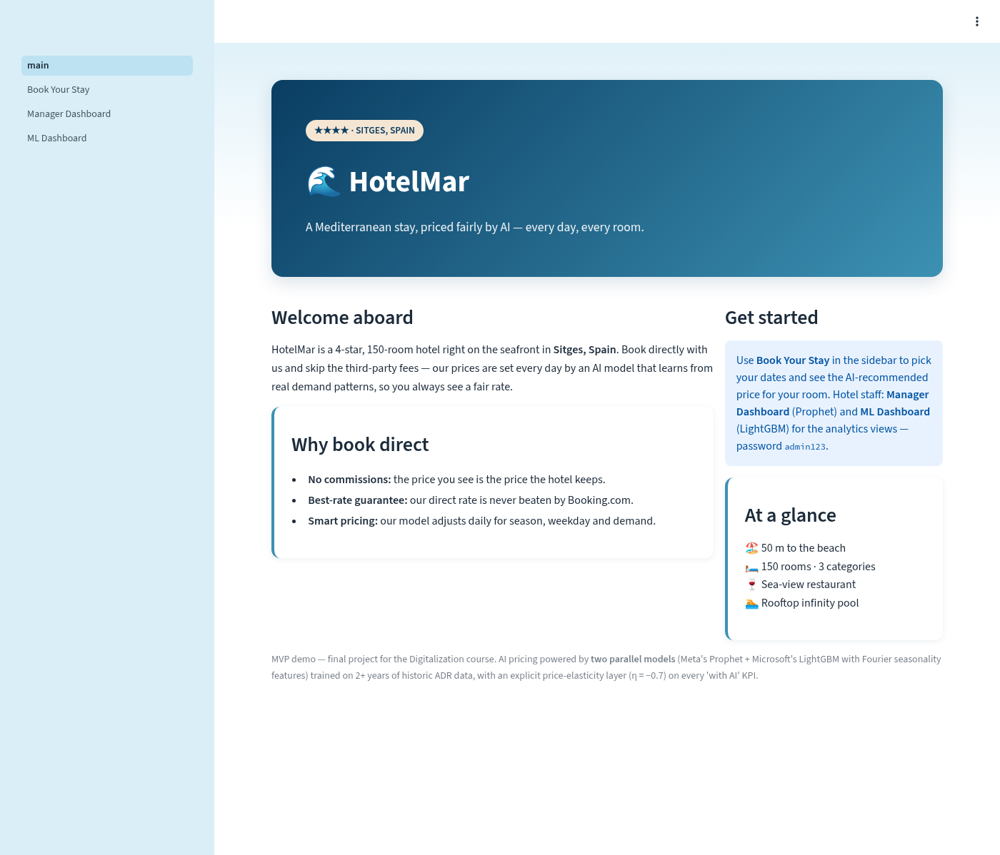
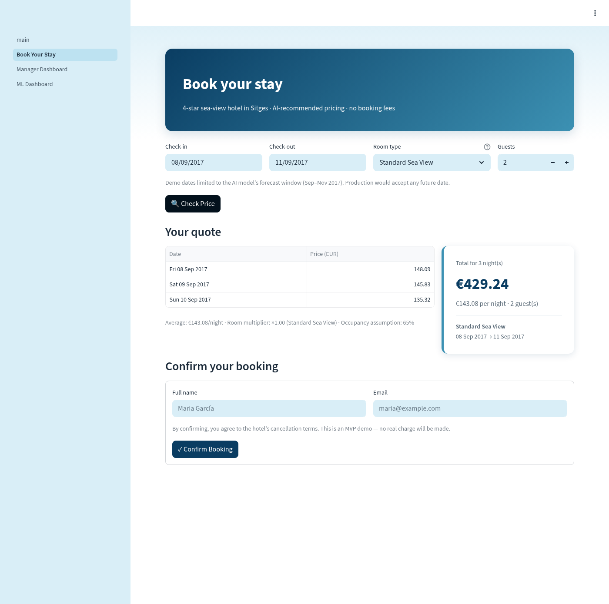
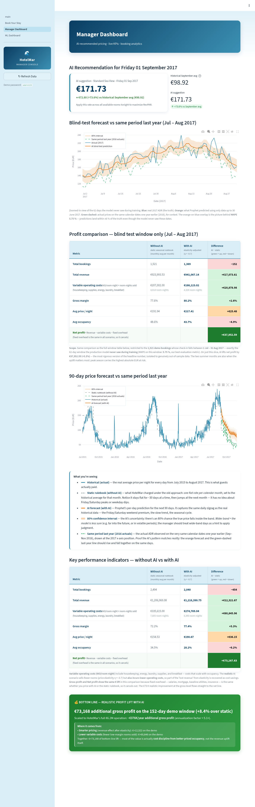

# HotelMar — AI-Powered Direct Booking & Dynamic Pricing

> 🌊 **Live demo:** **<https://degitalisazionporjectofinal-jbqw9jfbm45spzoaf9dqep.streamlit.app/>**

Final project for the Digitalization course.



## What this is

HotelMar is a 4-star, 150-room hotel in Sitges (Spain). Today, ~75% of its
bookings come through Booking.com, costing roughly €180,000/year in
commissions. Static seasonal pricing also leaves money on the table.

This MVP is a small web app that addresses both problems:

1. **Direct booking page** — guests can book on the hotel's own site, so
   the hotel keeps 100% of the revenue.
2. **AI price recommender** — a Prophet time-series model suggests the
   optimal daily room rate to maximize **RevPAR** (Revenue Per
   Available Room).

## How to use the demo

1. Open the **live URL above**.
2. **Book a stay** — sidebar → **Book Your Stay**. Pick any dates
   inside the demo window (Sep – Nov 2017), choose a room type, click
   **Check Price**, fill in name + email, click **Confirm Booking**.
   You'll get a `HM-XXXXXX` reference and a balloon animation.
3. **Open the manager dashboard** — sidebar → **Manager Dashboard**.
   Password is **`admin123`** (in-page notice explains why production
   would use real auth). You'll see today's AI-recommended price, the
   90-day forecast chart, the four KPIs, the recent bookings table
   (your test booking appears at the top), and the revenue-by-day chart.

### Guest booking page



The model knows that Friday and Saturday cost more than Sunday — you can
see the difference in the per-night breakdown.

### Manager dashboard



## Tech stack

- Python 3.11
- [Streamlit](https://streamlit.io/) 1.57 — web UI
- [Prophet](https://facebook.github.io/prophet/) 1.3 — time-series forecasting
- Pandas 3.0, NumPy 2.4 — data
- SQLite — booking storage
- Plotly 6.7 — charts
- Streamlit Community Cloud — free hosting

## Data

Source: Kaggle "Hotel Booking Demand" dataset (~119k bookings).
We use only **Resort Hotel** rows and exclude cancellations.
The price column is `adr` (Average Daily Rate).

## Demo timeline

The AI model is trained on Hotel Booking Demand data
(**Jul 2015 – Aug 2017**) and forecasts through **Nov 2017**.
The demo date is fixed at **Sep 15, 2017** to keep all predictions
inside the trained range. Production would use today's date and
continuously retrain.

This is why the booking page only accepts dates between Sep 2017 and
Nov 2017, and why the manager dashboard shows numbers for
"Friday 15 September 2017" rather than the calendar date you're
running it on.

## Model evaluation

Trained Prophet on the first ~2 years (731 days, chronological), then
blind-tested on the most recent 2 months (62 days, peak summer
Jul–Aug 2017):

| Metric | Value |
|--------|------:|
| MAE    | €10.90 / night |
| RMSE   | €14.06 / night |
| MAPE   | **5.75 %** — *excellent* (industry rule: <10% excellent, 10–20% good) |

After evaluation passed, the production model was refit on the full
793 days. See `data/test_evaluation.png` for the visual back-test.

## Project structure

```
HotelMar/                   <- repo root
├── .streamlit/config.toml  # cloud-ready theme
├── data/                   # raw CSV + cleaned daily_prices.csv + forecast.csv
├── docs/                   # README screenshots
├── scripts/                # 01_prepare_data, 02_train_model, 03_seed_demo_bookings
├── app/                    # main.py + pages/ + utils.py
├── models/                 # price_model.pkl (committed — needed by Cloud)
├── requirements.txt        # pinned for cloud reproducibility
├── .gitignore
└── README.md
```

## Quick start (local)

```bash
# 1. Create the virtual environment (Python 3.11+)
python3.11 -m venv venv
source venv/bin/activate

# 2. Install dependencies
pip install -r requirements.txt

# 3. Run the app — model.pkl is already in the repo
streamlit run app/main.py
# -> http://localhost:8501
```

If you want to rebuild the model from scratch:

```bash
python scripts/01_prepare_data.py   # cleans CSV -> data/daily_prices.csv
python scripts/02_train_model.py    # 80/20 eval + retrain prod model
python scripts/03_seed_demo_bookings.py   # optional — app auto-seeds on first boot
```

## Auto-seeding

`bookings.db` is gitignored, so a freshly cloned repo (and a fresh
Streamlit Cloud container) starts with no database. `app/utils.init_db()`
notices the empty table on first boot and runs `seed_demo_bookings()`
automatically — adds ~600 ms to the first page load and gives the
dashboard ~2,494 reservations to show right away.

If you want to wipe and reseed manually, delete `data/bookings.db` and
restart the app, or run `python scripts/03_seed_demo_bookings.py`.

## Deploying to Streamlit Community Cloud

The repo is configured to deploy as-is. Steps:

1. Sign in at <https://share.streamlit.io> with the GitHub account that
   owns this repo.
2. Click **Create app** → **Deploy a public app from GitHub**.
3. Fill in:
   - **Repository:** `MohamedYassineBenomar/Degitalisazion_Porjecto_Final`
   - **Branch:** `main`
   - **Main file path:** `app/main.py`  *(no `HotelMar/` prefix — the
     repo root **is** the project root)*
   - **Advanced settings → Python version:** `3.11`
4. Click **Deploy**. The first build takes **5–10 minutes** because
   Prophet pulls cmdstanpy + matplotlib + pyarrow. Subsequent deploys
   are much faster (~1 min) thanks to layer caching.
5. Once the build finishes, the app boots, `init_db()` auto-seeds the
   demo bookings (~1 s extra on the first page load), and the URL goes
   live.

> ⚠️ **`models/price_model.pkl` must be committed** for the deployed
> app to work. The repo's `.gitignore` un-ignores that specific file
> while still ignoring any other `*.pkl`. If you ever rebuild the
> model with `scripts/02_train_model.py`, remember to commit the new
> `.pkl` so Cloud picks it up on the next deploy.

## Roadmap (milestones)

| Tag    | What's done                                                |
| ------ | ---------------------------------------------------------- |
| v0.1   | Project setup + data preparation                           |
| v0.2   | Prophet model trained & saved                              |
| v0.2.1 | Train/test split with MAPE evaluation (16.99% — *good*)    |
| v0.3   | Guest-facing booking page                                  |
| v0.4   | Manager dashboard with KPIs, forecast, bookings view       |
| v0.5   | Demo timeline pinned to model forecast window              |
| v1.0   | **Deployed to Streamlit Community Cloud**                  |
