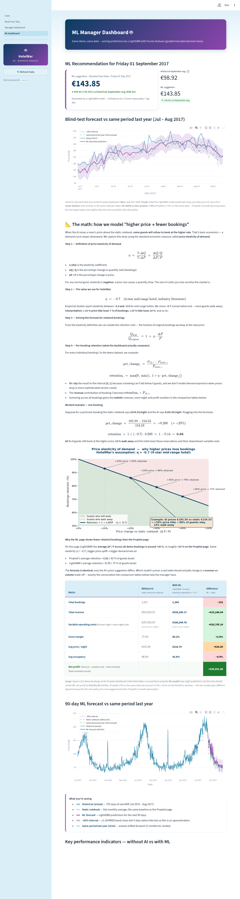

# HotelMar — AI-Powered Direct Booking & Dynamic Pricing

> 🌊 **Live demo:** **<https://degitalisazionporjectofinal-jbqw9jfbm45spzoaf9dqep.streamlit.app/>**

Final project for the Digitalization course. Current build: **`v1.14-elasticity-math-block`**.


## What this is

HotelMar is a 4-star, 150-room hotel in Sitges (Spain). Today, ~75 % of its
bookings come through Booking.com, costing roughly €180,000/year in
commissions. Static seasonal pricing also leaves money on the table.

This MVP is a small web app that addresses both problems:

1. **Direct booking page** — guests book on the hotel's own site, so the
   hotel keeps 100 % of the revenue.
2. **AI price recommender** — **two** models suggest the optimal daily
   room rate to maximise **RevPAR** (Revenue Per Available Room):
   - **Prophet** (Meta) — a Bayesian additive time-series model. The
     production baseline.
   - **LightGBM + Fourier features** (Microsoft) — a modern gradient-
     boosted tree ensemble. Same dashboard, parallel page, for the
     model-vs-model comparison defense.
3. **Price-elasticity economics** — every "with AI" KPI accounts for the
   fact that raising prices loses some guests (η = −0.7), so the
   bottom-line profit lift is realistic, not naive.

## How to use the demo

1. Open the **live URL above**.
2. **Book a stay** — sidebar → **Book Your Stay**. Pick any dates inside
   the demo window (Sep – Nov 2017), choose a room type, click **Check
   Price**, fill in name + email, click **Confirm Booking**. You'll get
   a `HM-XXXXXX` reference and a balloon animation.
3. **Open the manager dashboard** — sidebar → **Manager Dashboard**.
   Password **`admin123`** is pre-filled; just click **Sign in**. You'll
   see today's AI-recommended price, a blind-test forecast chart, a
   blind-test profit comparison, the 90-day forecast, and a full-window
   KPI comparison with the BOTTOM-LINE callout.
4. **Open the ML dashboard** — sidebar → **ML Dashboard**. Same
   structure, but every prediction comes from **LightGBM + Fourier
   features** instead of Prophet. Includes a LaTeX maths section that
   walks through the price-elasticity formula step by step, and a head-
   to-head Prophet-vs-LightGBM comparison at the bottom.

### Guest booking page


The model learned that Friday and Saturday cost more than Sunday — you
can see the difference in the per-night breakdown.

### Manager dashboard (Prophet)


### ML dashboard (LightGBM + Fourier)



## Tech stack

- **Python 3.11**
- **[Streamlit](https://streamlit.io/) 1.57** — web UI (multi-page)
- **[Prophet](https://facebook.github.io/prophet/) 1.3** — Bayesian
  time-series forecasting (production model)
- **[LightGBM](https://lightgbm.readthedocs.io/) 4.6** — gradient-
  boosted decision trees (parallel ML page)
- **[scikit-learn](https://scikit-learn.org/) 1.8** — model utilities
- **Pandas 3.0**, **NumPy 2.4** — data
- **SQLite** — booking storage
- **[Plotly](https://plotly.com/) 6.7** — interactive charts
- **Streamlit Community Cloud** — free hosting, auto-deploy from GitHub

## Data

Source: Kaggle "Hotel Booking Demand" dataset (~119k bookings, two
Portuguese hotels). We use only the **Resort Hotel** rows and exclude
cancellations — the closest available analogue for a Mediterranean
Spanish 4-star resort. The price column is `adr` (Average Daily Rate).

Pipeline (in `scripts/01_prepare_data.py`):

```
119,390  raw rows
  ↓  filter: hotel == "Resort Hotel"
 40,060  resort hotel only
  ↓  filter: is_canceled == 0
 28,938  non-cancelled
  ↓  group by arrival_date → mean(adr)  +  10 ≤ ADR ≤ 500
    793  daily-average prices  ◄── what both models train on
```

## Demo timeline

The dataset ends on **31 Aug 2017** and the production model forecasts
90 days ahead (through 29 Nov 2017). The demo date is **fixed at
Friday 1 September 2017** to keep all predictions inside the trained
range. Production would use today's date and continuously retrain.

This is why the booking page only accepts dates between Sep 2017 and
Nov 2017, and why both dashboards show "today's price" for *Friday 01
September 2017* rather than the calendar date you're viewing.

## Model evaluation (blind hold-out, same dates both models)

We train on the first **731 days** (Jul 2015 → Jun 2017) and **blind-
test** on the last **62 days** (Jul 1 → Aug 31 2017, the peak summer
window — the highest-stakes period for revenue management). The
production model is then refit on the full 793 days.

| Metric | Prophet | LightGBM + Fourier |
|--------|--------:|-------------------:|
| MAE    | €10.90 / night | €14.76 / night |
| RMSE   | €14.06 / night | €18.14 / night |
| **MAPE** | **5.75 %** *(excellent)* | **7.90 %** *(excellent)* |

Both land in the **excellent** bracket (<10 % MAPE). Prophet wins by
~2 percentage points on this dataset because the data is exactly its
sweet spot: short (793 days), univariate, strong yearly + weekly
seasonality. LightGBM scales better when extra covariates (weather,
events, competitor rates) become available — that's the operational
trade-off the ML page documents.

See `data/test_evaluation.png` (Prophet) and `data/test_evaluation_ml.png`
(LightGBM) for the visual back-tests, and
`defense/data_pipeline.md` for the column-by-column data audit.

## Price-elasticity model

Every "with AI" KPI on both dashboards accounts for the fact that
**raising prices loses some guests**. We use the standard economic
definition with η = −0.7 (the conservative end of the −0.4 to −0.8
range reported in industry literature for 4-star hotels):

$$\text{retention}_i = \max\!\bigl(0,\; \min(1,\; 1 + \eta \cdot \text{pct\_change}_i)\bigr)$$

where $\text{pct\_change}_i = (P_{\text{AI}} - P_{\text{static}}) / P_{\text{static}}$
for each booking. The ML Dashboard includes a full LaTeX-rendered
walkthrough of this formula with a worked example.

## Project structure

```
HotelMar/                       <- repo root
├── .streamlit/config.toml      # cloud-ready light theme
├── app/
│   ├── main.py                 # Streamlit entry / landing page
│   ├── utils.py                # shared helpers, model loaders, KPI math
│   └── pages/
│       ├── 1_Book_Your_Stay.py    # guest booking UI
│       ├── 2_Manager_Dashboard.py # Prophet dashboard (admin123 pre-filled)
│       └── 3_ML_Dashboard.py      # LightGBM dashboard + elasticity maths
├── data/                       # all the data artefacts
│   ├── hotel_bookings.csv         # raw Kaggle dataset (17 MB)
│   ├── daily_prices.csv           # 793-day training series for both models
│   ├── forecast.csv               # Prophet 90-day forward forecast
│   ├── forecast_ml.csv            # LightGBM 90-day forward forecast
│   ├── blind_test_predictions.csv      # Prophet on Jul–Aug 2017 blind test
│   ├── blind_test_predictions_ml.csv   # LightGBM on the same window
│   ├── test_evaluation.png            # Prophet eval plot (matplotlib)
│   ├── test_evaluation_ml.png         # LightGBM eval plot
│   ├── forecast_plot.png              # Prophet 90-day plot
│   ├── forecast_plot_ml.png           # LightGBM 90-day plot
│   └── bookings.db                    # SQLite, gitignored, auto-seeded
├── models/
│   ├── price_model.pkl         # Prophet production model
│   └── price_model_ml.pkl      # LightGBM production model
├── scripts/
│   ├── 01_prepare_data.py      # raw → 793-day daily ADR series
│   ├── 02_train_model.py       # Prophet train + eval + production fit
│   ├── 03_seed_demo_bookings.py # populate bookings.db (~2,494 reservations)
│   └── 04_train_ml_model.py    # LightGBM train + eval + production fit
├── defense/                    # jury defense materials
│   ├── demo_script.md          # 5-minute walkthrough with exact clicks
│   ├── qa_prep.md              # 10 likely jury questions + answers
│   ├── architecture_summary.md # cloud-fog-edge-mist tier map
│   ├── key_numbers.md          # cheat sheet
│   └── data_pipeline.md        # column-by-column data audit
├── docs/                       # README screenshots
├── requirements.txt            # pinned for Cloud reproducibility
├── .gitignore
└── README.md                   # this file
```

## Quick start (local)

```bash
# 1. Create the virtual environment (Python 3.11+)
python3.11 -m venv venv
source venv/bin/activate

# 2. Install dependencies (includes Prophet, LightGBM, scikit-learn)
pip install -r requirements.txt

# 3. Run the app — both models are already pickled in the repo
streamlit run app/main.py
# -> http://localhost:8501
```

If you want to rebuild the models from scratch:

```bash
python scripts/01_prepare_data.py        # raw CSV  →  daily_prices.csv
python scripts/02_train_model.py         # Prophet (731/62 split, MAPE 5.75 %)
python scripts/04_train_ml_model.py      # LightGBM (same split, MAPE 7.90 %)
python scripts/03_seed_demo_bookings.py  # optional — app auto-seeds on boot
```

## Auto-seeding

`bookings.db` is gitignored, so a freshly cloned repo (and a fresh
Streamlit Cloud container) starts with no database. `utils.init_db()`
notices the empty table on first boot and runs `seed_demo_bookings()`
automatically — adds ~600 ms to the first page load and gives both
dashboards ~2,494 reservations to display right away.

To wipe and reseed manually, delete `data/bookings.db` and restart the
app, or run `python scripts/03_seed_demo_bookings.py`.

## Deploying to Streamlit Community Cloud

The repo is configured to deploy as-is. Steps:

1. Sign in at <https://share.streamlit.io> with the GitHub account that
   owns this repo.
2. Click **Create app** → **Deploy a public app from GitHub**.
3. Fill in:
   - **Repository:** `MohamedYassineBenomar/Degitalisazion_Porjecto_Final`
   - **Branch:** `main`
   - **Main file path:** `app/main.py` *(no `HotelMar/` prefix — the
     repo root **is** the project root)*
   - **Advanced settings → Python version:** `3.11`
4. Click **Deploy**. The first build takes **~10 minutes** because
   Prophet pulls cmdstanpy, and LightGBM + scikit-learn pull SciPy.
   Subsequent deploys are much faster (~1 min) thanks to layer caching.
5. Once the build finishes, the app boots, `init_db()` auto-seeds the
   demo bookings (~1 s extra on the first page load), and the URL goes
   live.

> ⚠️ **`models/price_model.pkl` and `models/price_model_ml.pkl` must
> both be committed** for the deployed app to work. The repo's
> `.gitignore` un-ignores those specific files while still ignoring
> any other `*.pkl`. If you rebuild a model via the scripts, remember
> to commit the new `.pkl` so Cloud picks it up on the next deploy.

## Defense materials

Five documents in `defense/` for the jury presentation:

- `demo_script.md` — minute-by-minute walkthrough with exact clicks and
  speaker text.
- `qa_prep.md` — one-paragraph answers to the ten most likely jury
  questions (Prophet vs deep learning, GDPR, EU AI Act, model failure
  safety, MVP scoping vs Phase 2–4, ROI math, etc.).
- `architecture_summary.md` — one-page cloud → fog → edge → mist tier
  map, showing what the MVP built and what's scoped as future phases.
- `key_numbers.md` — single-page cheat sheet you can glance at one
  minute before walking in.
- `data_pipeline.md` — column-by-column audit of what data entered the
  pipeline and what was deliberately excluded.

## Roadmap (milestones)

| Tag      | What's done                                                              |
| -------- | ------------------------------------------------------------------------ |
| v0.1     | Project setup + data preparation                                         |
| v0.2     | Prophet model trained & saved                                            |
| v0.2.1   | Train/test split with MAPE evaluation                                    |
| v0.3     | Guest-facing booking page                                                |
| v0.4     | Manager dashboard with KPIs, forecast, bookings view                     |
| v0.5     | Demo timeline pinned to model forecast window                            |
| **v1.0** | **Deployed to Streamlit Community Cloud**                                |
| v1.1     | Without-AI vs With-AI comparison view (revenue lift)                     |
| v1.2     | Price-elasticity column (η = −0.7) + year-over-year overlay              |
| v1.3     | Variable operating costs (€43/room-night) → gross-profit comparison      |
| v1.4     | Net-profit row, styled diff column, P&L re-skin                          |
| v1.5     | KPI table restructured (no naïve column, orange avg-price diff)          |
| v1.6     | Diff cells: cost-saving green, headline net-profit band, "%" suffix      |
| v1.7     | Hold-out switched to 2-year-train / 2-month-blind summer window          |
| v1.8     | Blind-test YoY forecast chart                                            |
| v1.9     | Profit-comparison table restricted to the blind-test window              |
| v1.10    | Section reorder — blind-test sections come first                         |
| v1.11    | **ML Dashboard page added** (Gradient Boosting, scikit-learn)            |
| v1.12    | Demo date shifted to 1 Sep 2017; trailing dashboard sections removed     |
| v1.13    | **ML page upgraded** to LightGBM + Fourier features (MAPE 7.90 %)        |
| v1.14    | LaTeX-rendered price-elasticity maths block on the ML dashboard          |
